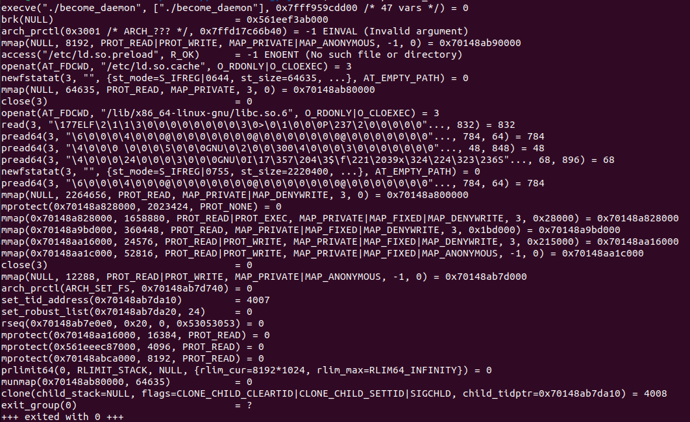
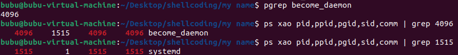
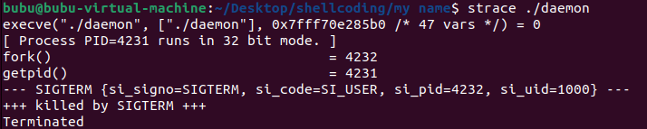
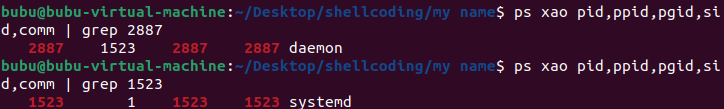
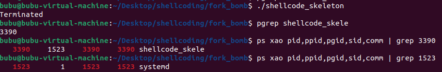

# Basic Shellcoding For Linux - The Full Guide

***disclaimer***  
This guide was created for educational purposes only, it was formed after long hours of browsing the internet and learning the basic principles of shellcoding, article by article, gathering small bits of information until the entire image became clearer.  
Before reading I should clarify, my struggle learning shellcoding came from my lack of knowledge in assembly while having a decent understanding of the logic needed in order to write a successful shellcode.  
So without further ado, lets dive in.  

## What Is A Shellcode?

A shellcode is basically a payload used by attackers, crafted in order to exploit a vulnerability, it should be as small in size as possible.  
As mentioned above, a shellcode needs to be meticulously crafted and so it is usually written in assembly by hand.  
One might ask themselves, why not just write a piece of c language code, compile it, hex dump it and use it as a payload?   
Well since a shellcode is basically a "string" if we have null bytes it might cut the payload in the middle, a thing that will most probably occur in the given scenario.  

Before we dive further in regarding the technical details of writing a successful shellcode there are couple required tools:  
- a Linux machine, i use ubuntu 22.04, kernel version 6.8.0-48, with disabled aslr (echo 0 > /proc/sys/kernel/randomize_va_space)  
- nasm (gcc-multilib)  
- ld  
- objdump  
- gcc  

For the sake of this guide i'll write the examples in 32-bit  
After writing our assembly code we will compile it to object file using the following command:  
```
nasm -f elf32 -o <prog_name>.o <prog_name>.asm
```
Next, we'll compile the object file into an executable:  
```
ld -m elf_i386 -o <prog_name> <prog_name>.o
```
The last step is extracting the payload from the executable:  
```
objdump -d ./<prog_name> | grep '[0-9a-f]:' | grep -v 'file' | cut -f2 -d: | cut -f1-6 -d' ' | tr -s ' ' | tr '\t' ' ' | sed 's/ $//g' | sed 's/ /\\x/g' |paste -d '' -s | sed 's/^/"/' | sed 's/$/"/g'   
```

## Do's And Don'ts - Spot The Differences
Let's start with a simple example, these 2 instructions are used for a simple, yet inevitable task, initializing a register.  
```
xor  eax, eax
```
```
mov  eax, 0
```
The first option is optimal, uses only one instruction and wont cause any null bytes. on the other hand the second option, while being one instruction will cause a null terminator in the middle of our payload.  

In the following example, both will work perfectly fine for writing a shellcode and wont cause any vital errors
```
xor  eax, eax
cdq
```
```
xor  eax, eax
xor  edx, edx
```
As we can see, both options will work perfectly for a shellcode but the first code block will result in a shorter payload.  
Working with strings in assembly can be quit a headache, lucky for us we can use the data segment! (or can we?)
```
section .text
global _start
_start:
    xor     eax, eax
    cdq
    ... 
    jmp     my_label
my_label_again:                         
    ...
    pop    ecx 
    int    0x80
my_label:
    call    my_label_again
    db "hello world"
```
```
section .data
thing    db "hello world", 0

section .text
global _start
_start:
    ...
    mov ecx, thing
    int    0x80
```
even though the second option requires about half the instructions, in shellcodes only the text section can be extracted into the payload so sadly our string in the data section in the second example will be lost during the payload extraction process.

## From Registers To Syscalls
Now that the fundamental principles for shellcoding are clear we can start crafting an actual working payload.  
The first I reccomend doing is trying to imagine the goal of our shellcode and understand what syscalls are needed in order to achieve it, the simplest example it printing hello world to the terminal.  
As we know the syscall needed is write() to fd 1 (stdout), a quick look in a syscall table for x86 shows us that in order to execute this syscall we need the following registers to contain some certain data:
- eax = syscall number (int)
- ebx = fd (int)
- ecx = buffer for printing (const char *)
- edx = buffer size (int)  

And of course we'll need to exit the shellcode as well using the syscall exit():
- eax = syscall number
- ebx = error number (if there is no error just put 0)
When implementing everything we learned so far we end up with the following code:
```
;say_hello.asm
[SECTION .text]

global _start

_start:
    xor eax, eax
    cdq
    xor ebx, ebx
    xor ecx, ecx
    jmp label_hello

    label_write:
    pop ecx
    mov al, 4       
    mov bl, 1
    mov dl, 11
    int 0x80
    xor eax, eax
    mov al, 1 
    xor ebx,ebx
    int 0x80

    label_hello:

    call label_write
    db 'hello world'
```
The next step is preforming the shellcode extraction, the output is the following
```
\x31\xc0\x99\x31\xdb\x31\xc9\xeb\x11\x59\xb0\x04\xb3\x01\xb2\x0b\xcd\x80\x31\xc0\xb0\x01\x31\xdb\xcd\x80\xe8\xea\xff\xff\xff\x68\x65\x6c\x6c\x6f\x20\x77\x6f\x72\x6c\x64
```
No null bytes and quite a small size - great success

## A Practical Example - Daemon
for those of you who dont know a daemon is a service in linux, it's distinct for not having a controlling terminal and being run under systemd.
this is achieved by running the following c function sequence: fork, setsid, chdir("/"), umask(0), sysconf(_SC_OPEN_MAX), close(0-_SC_OPEN_MAX), open("/dev/null"), dup2(0), dup2(1), dup2(2)
basically whats happenning here is forcing init to take over our process by making it an orphan, making sure we're not session leader, closing all the open file descriptors and redirecting stdin/stdout/stderr to /dev/null. 
the easiest way to "daemonize" a process is using libc make_daemon function, when we use this function and strace the executable we should see the following output:  



let's focus on the important bit, we can see clone being ran (because for some reason the fork c function uses the clone syscall and not fork syscall gotta love linux for that) and afterwards our process dies and the child process becomes an orphan and so the daemonizing process goes on.  
when we see afterwards who's the process parent we can see its systemd  


i will now show you how to achieve the same goal using a shellcode, we need to invoke the following syscalls:   
- fork() - eax = 2  
- getpid() - eax = 20  
- kill(our pid, 15) - eax = 37  
- setsid() - eax = 66  
- chdir("/") - eax = 12  
- umask(0) - eax = 60  
- close(all huge range of possible FDs) - eax = 6  
- open("/dev/null") - eax = 5  
- dup2(0-2) - eax 63  
- sleep(0, 60) - eax = 162  
- exit() - eax = 1  
  
here's the final result
```
daemon.asm
[SECTION .text]

global _start

_start:
        xor eax, eax
        cdq
        xor ebx, ebx
        xor ecx, ecx

        label_ffork:       
        mov al, 2       
        int 0x80
        xor eax, eax
        mov al, 20
        int 0x80
        mov ebx, eax
        mov eax, 37
        mov ecx, 15
        dec ebx
        int 0x80
        jmp label_setsid

        label_setsid:
        xor eax, eax
        mov al, 66
        int 0x80
        jmp label_chdir

        label_chdir:
        xor eax, eax
        push word '/'
        mov ebx, esp
        mov al, 12
        int 0x80
        jmp label_umask


        label_umask:
        xor eax, eax
        xor ebx, ebx
        mov al, 60
        int 0x80
        xor eax, eax
        cdq
        xor ebx, ebx
        xor ecx, ecx
        jmp label_closes

        label_closes:
        xor eax, eax
        cmp ecx, 256           
        jge label_path         

        mov ebx, ecx           
        mov al, 6              
        int 0x80               

        inc ecx                
        jmp label_closes       

        label_devnull:
        xor eax, eax
        cdq
        xor ebx, ebx
        xor ecx, ecx
        mov al, 6
        int 0x80
        xor eax, eax
        xor ebx, ebx
        mov al, 5           
        pop ebx  
        mov ecx, 2          
        xor edx, edx        
        int 0x80            
        mov ebx, eax        
        xor eax, eax
        mov al, 63          
        xor ecx, ecx        
        int 0x80            
        xor eax, eax
        mov al, 63          
        mov ecx, 1          
        int 0x80            
        xor eax, eax
        mov eax, 63         
        mov ecx, 2          
        int 0x80            
        jmp label_sleep

        label_sleep:
        xor eax, eax
        xor ebx, ebx
        push ax
        push 60
        mov ebx, esp
        mov al, 162
        int 0x80
        xor eax, eax
        xor ebx, ebx
        xor ecx, ecx
        mov al, 1
        int 0x80

        label_path:
        call label_devnull
        db '/dev/null'
```

i split the code into a few labels
- label_ffork - do fork, then get our pid and kill our process
- label_setsid - preform setsid
- label_chdir - prefrom chdir("/")
- label_umask - preform umask(0) and re-initialize the registers for the next label
- label_closes - close a whole bunch of file descriptors
- label_devnull - make sure again that fd 0 is close, open /dev/null for redirecting fds 0-2 and use dup2 to preform the redirection
- label_sleep - make our daemon sleep for a minute so we have time to examine it (this is the place to put the actions you want the daemon to preform) and use exit to kill the daemon
- label_path - push the string '/dev/null' to the stack for label_devnull and call label_devnull

when strace-ing we expect to see fork being executed and then the code exits since the shellcode is as minimalistic as possible not like the compiled c code



and the parent process really is systemd



great success.

the extracted shellcode
```
\x31\xc0\x99\x31\xdb\x31\xc9\xb0\x02\xcd\x80\x31\xc0\xb0\x14\xcd\x80\x89\xc3\xb8\x25\x00\x00\x00\xb9\x0f\x00\x00\x00\x4b\xcd\x80\xeb\x00\x31\xc0\xb0\x42\xcd\x80\xeb\x00\x31\xc0\x66\x6a\x2f\x89\xe3\xb0\x0c\xcd\x80\xeb\x00\x31\xc0\x31\xdb\xb0\x3c\xcd\x80\x31\xc0\x99\x31\xdb\x31\xc9\xeb\x00\x31\xc0\x81\xf9\x00\x01\x00\x00\x7d\x61\x89\xcb\xb0\x06\xcd\x80\x41\xeb\xed\x31\xc0\x99\x31\xdb\x31\xc9\xb0\x06\xcd\x80\x31\xc0\x31\xdb\xb0\x05\x5b\xb9\x02\x00\x00\x00\x31\xd2\xcd\x80\x89\xc3\x31\xc0\xb0\x3f\x31\xc9\xcd\x80\x31\xc0\xb0\x3f\xb9\x01\x00\x00\x00\xcd\x80\x31\xc0\xb8\x3f\x00\x00\x00\xb9\x02\x00\x00\x00\xcd\x80\xeb\x00\x31\xc0\x31\xdb\x66\x50\x6a\x3c\x89\xe3\xb0\xa2\xcd\x80\x31\xc0\x31\xdb\x31\xc9\xb0\x01\xcd\x80\xe8\xa3\xff\xff\xff\x2f\x64\x65\x76\x2f\x6e\x75\x6c\x6c
```

unfortunately we have a few null bytes in the shellcode so we have to examine it and make sure it doesnt cut in the middle
we want to check this in a legitimate way so the following c code defines the shellcode as text section and runs it  
```
#include <stdio.h>
unsigned char  __attribute__((section(".text#"))) code[] = "\x31\xc0\x99\x31\xdb\x31\xc9\xb0\x02\xcd\x80\x31\xc0\xb0\x14\xcd\x80\x89\xc3\xb8\x25\x00\x00\x00\xb9\x0f\x00\x00\x00\x4b\xcd\x80\xeb\x00\x31\xc0\xb0\x42\xcd\x80\xeb\x00\x31\xc0\x66\x6a\x2f\x89\xe3\xb0\x0c\xcd\x80\xeb\x00\x31\xc0\x31\xdb\xb0\x3c\xcd\x80\x31\xc0\x99\x31\xdb\x31\xc9\xeb\x00\x31\xc0\x81\xf9\x00\x01\x00\x00\x7d\x61\x89\xcb\xb0\x06\xcd\x80\x41\xeb\xed\x31\xc0\x99\x31\xdb\x31\xc9\xb0\x06\xcd\x80\x31\xc0\x31\xdb\xb0\x05\x5b\xb9\x02\x00\x00\x00\x31\xd2\xcd\x80\x89\xc3\x31\xc0\xb0\x3f\x31\xc9\xcd\x80\x31\xc0\xb0\x3f\xb9\x01\x00\x00\x00\xcd\x80\x31\xc0\xb8\x3f\x00\x00\x00\xb9\x02\x00\x00\x00\xcd\x80\xeb\x00\x31\xc0\x31\xdb\x66\x50\x6a\x3c\x89\xe3\xb0\xa2\xcd\x80\x31\xc0\x31\xdb\x31\xc9\xb0\x01\xcd\x80\xe8\xa3\xff\xff\xff\x2f\x64\x65\x76\x2f\x6e\x75\x6c\x6c";

int main()
{
  int (*ret)() = (int(*)())code;
  ret();
}
```
the command for proper compiling is the following  
```
gcc -zexecstack -m32 -o shellcode_skeleton shellcode_skeleton.c
```

and like before, checking if it really runs under systemd   



## Every Good Thing Comes To An End
i hope this guide made this whole grey-area a tad bit clearer, i will continue to upload shellcodes i write for fun every now and then to the asm directory :)
